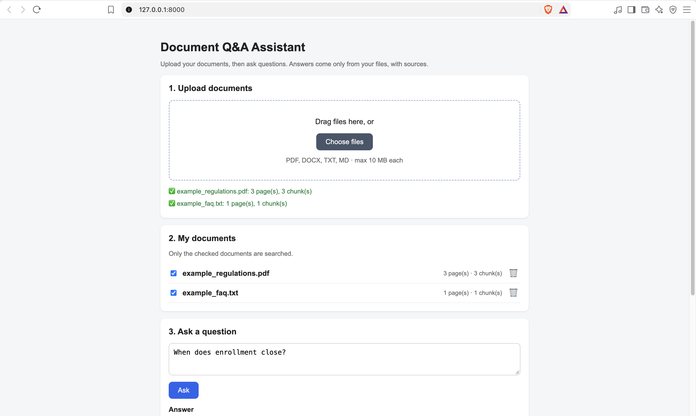
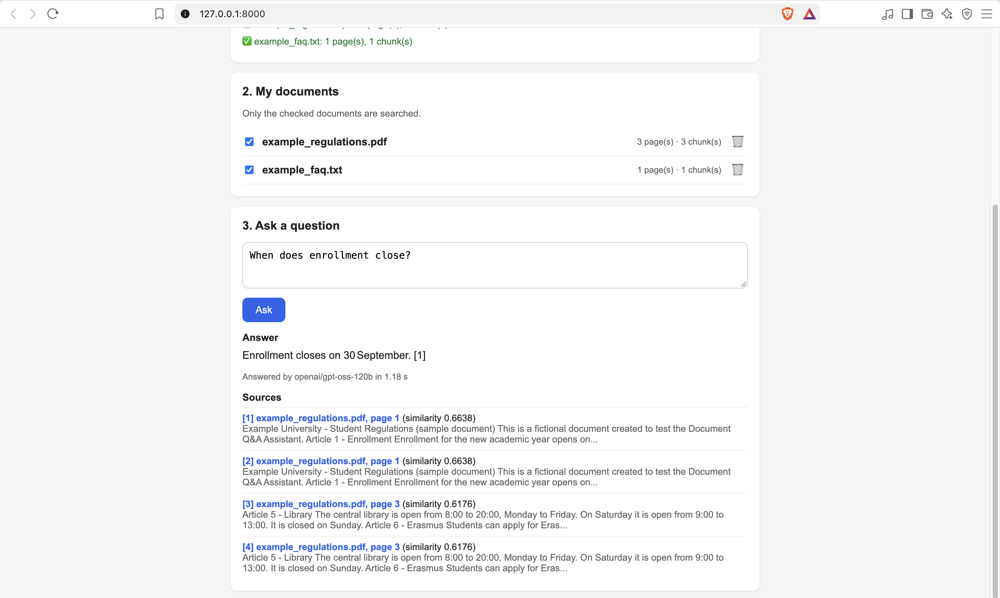

# Document Q&A Assistant (v2)

Upload your own documents (PDF, DOCX, TXT, MD) from the web page and ask questions about them.
Answers come **only from your files**, with **citations** (file + page).

Built with Python, FastAPI, SQLite, NumPy and plain HTML/CSS/JavaScript.
Answers are written by **Groq (Llama 3.3 70B)**, retrieval uses **Gemini embeddings**; any OpenAI-compatible provider can be switched in from `.env`.

| | |
|:--|:--|
|  |  |   

## What's new in v2
| v1 | v2 |
|---|---|
| Documents fixed in a folder, indexed once with a script | Users upload documents from the page; each file is indexed when it arrives |
| One index for everything | One index **per document**: add or delete a file without rebuilding the rest |
| Always searches all documents | Searches only the documents the user checks |
| No record of documents | SQLite table with name, type, pages, chunks, upload time |
| One HTML file | Frontend split into `index.html`, `style.css`, `app.js` (upload, drag & drop, list, delete, ask) |

## How it works

```
UPLOAD   file ─► check (type, size, real PDF?) ─► save with random name ─► read text per page
              ─► chunks ─► embeddings ─► storage/index/<id>/ ─► row in SQLite ─► 201 Created

ASK      question + checked document ids ─► load only those indexes ─► embedding of the question
              ─► cosine similarity ─► top-k chunks ─► prompt ─► LLM ─► answer with [1] [2] + sources
```

## API

| Method | URL | What it does |
|---|---|---|
| `POST` | `/documents` | Upload one file (multipart/form-data). `201`, or `413` too big, `415` wrong type, `422` no text |
| `GET` | `/documents` | List documents |
| `DELETE` | `/documents/{id}` | Delete a document (file + index + record). `204`, or `404` |
| `POST` | `/ask` | `{"question": "...", "document_ids": [...]}`; without `document_ids` it searches all |
| `GET` | `/health` | Health check |

Interactive documentation: `http://127.0.0.1:8000/docs`

## Project structure
```
doc-qa-assistant/
├── app/
│   ├── config.py      # settings + upload limits + storage paths
│   ├── main.py        # FastAPI endpoints
│   ├── ingest.py      # upload pipeline: check → save → read → chunk → embed → store
│   ├── database.py    # SQLite "documents" table
│   ├── loader.py      # PDF / DOCX / TXT → text per page
│   ├── chunker.py     # text → overlapping chunks
│   ├── llm.py         # AI providers (Gemini or OpenAI-compatible), retry on temporary errors
│   ├── store.py       # one NumPy index per document + cosine search
│   └── rag.py         # choose documents → retrieve → prompt → answer
├── frontend/          # index.html, style.css, app.js
├── samples/           # small fictional documents for demos, tests and the evaluation
├── scripts/           # upload_folder.py (bulk upload), ask_cli.py
├── eval/              # questions.json + run_eval.py
├── tests/             # pytest: loader, database, store, API (AI provider is faked)
├── storage/           # created at runtime: uploads, indexes, app.db (not on GitHub)
├── Dockerfile
└── requirements.txt
```

## Run it
```bash
python -m venv .venv
source .venv/bin/activate          # Windows: .venv\Scripts\activate
pip install -r requirements.txt
cp .env.example .env               # then paste your keys
uvicorn app.main:app --host 0.0.0.0 --port 8000
```
Open http://127.0.0.1:8000 and upload a file (try the ones in `samples/`).

## Tests and evaluation
```bash
pytest                                   # 32 tests, no API key needed
python -m scripts.upload_folder samples  # upload the sample documents
python -m eval.run_eval                  # retrieval hit rate + answer pass rate
```

| Metric (sample documents) | Result |
|---|---|
| Retrieval hit rate | _fill in_ |
| Answer pass rate | _fill in_ |

## Design choices
- **One index per document** (NumPy + JSON in `storage/index/<id>/`): adding or deleting a file never rebuilds the others; searching selected documents = loading only their indexes.
- **SQLite for metadata**: a real SQL database in one file, no server.
- **Uploads are untrusted**: allowed types only, size and page limits, PDF signature check, random file names (the user's filename is only displayed), and the prompt tells the model to treat document text as data, not instructions (prompt injection).
- **Transparent answers**: every answer includes the `model` that wrote it and the total time in `seconds`; `CHAT_TEMPERATURE` is set in `.env`.
- **Frontend without a framework**: `fetch` + `FormData` + DOM; all user and server text is shown with `textContent` (no HTML injection).

## Limitations and next steps
- Single user: everyone who opens the page sees the same documents → next: a session id per browser.
- Indexing happens during the upload request → next: background processing with a status (processing / ready).
- Scanned PDFs have no text → OCR.
- Free hosting (Render) deletes `storage/` on restart → persistent disk or cloud storage.
